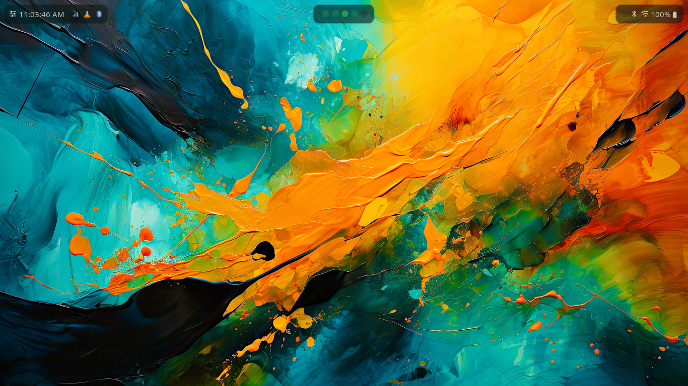
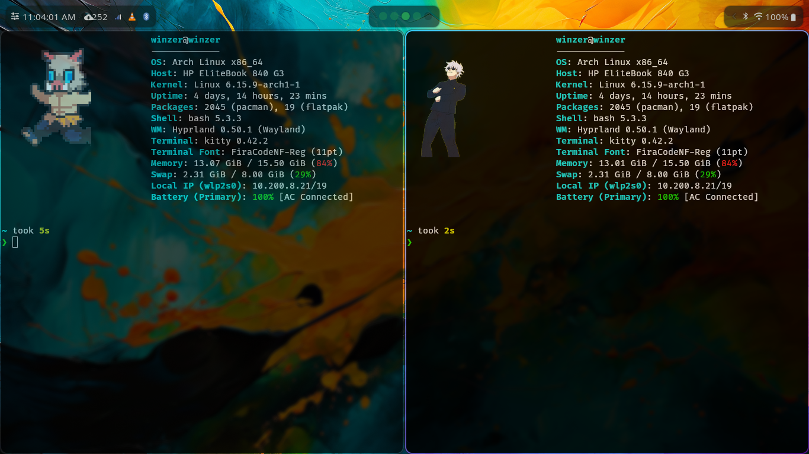

# 🚀 Dotfiles

<div align="center">



[](LICENSE)
[](https://hyprland.org)
[](https://github.com/Alexays/Waybar)
[](https://sw.kovidgoyal.net/kitty/)
[](https://github.com/winzerprince/dotfiles/stargazers)

A collection of my personal dotfiles for Hyprland on Arch. Some of the files have been inpired by other ricers on github and yes, I created most this readme with Ai specifically claude sonnet 4</div>

## 📋 Table of Contents

- [✨ Features](#-features)
- [�️ Preview](#️-preview)
- [�📱 Screenshots](#-screenshots)
- [🔍 What's Included](#-whats-included)
- [⚙️ Installation](#️-installation)
- [🖌️ Waybar Themes](#️-waybar-themes)
- [⌨️ Keyboard Shortcuts](#️-keyboard-shortcuts)
- [🔄 Sync Script](#-sync-script)
- [🎨 Color Picker Utility](#-color-picker-utility)
- [🔧 Customization Tips](#-customization-tips)
- [🙏 Credits](#-credits)
- [🤝 Contributing](#-contributing)
- [📄 License](#-license)

## ✨ Features

- **Hyprland** - A dynamic tiling Wayland compositor
- **Waybar** - Highly customizable bar with 4 different themes
- **Kitty** - Fast, feature-rich terminal emulator
- **Hyprpaper** - Wallpaper manager for Hyprland
- **Color Picker** - Script for picking colors and saving them
- **Sync Script** - Easy way to keep your dotfiles repository updated

## 🖼️ Preview

### Main Desktop View


### Interface Details



> Experience a clean, modern, and highly functional desktop environment

## 📱 Screenshots

<details>
<summary>Click to expand screenshots</summary>

### Desktop Setup Overview


A clean and modern desktop environment featuring Hyprland with Waybar, showcasing the default theme configuration.

### Detailed View


Close-up view of the interface elements, demonstrating the aesthetic design and functionality of the custom configurations.

> 🎨 **Note**: These screenshots showcase the actual setup running on Arch Linux with Hyprland. Your experience may vary based on your specific configuration and theme choices.

</details>

## 🔍 What's Included

```text
📁 dotfiles/
├── 📂 .config/
│   ├── 🎨 hypr/                    # Hyprland configuration
│   │   ├── hyprland.conf           # Main Hyprland config
│   │   └── hyprpaper.conf          # Wallpaper configuration
│   ├── 🖥️  kitty/                  # Kitty terminal configuration
│   │   └── kitty.conf              # Terminal settings & theme
│   └── 📊 waybar/                  # Waybar configuration
│       ├── assets/                 # Theme screenshots & icons
│       ├── config                  # Main waybar config
│       ├── style.css               # Styling for all themes
│       ├── scripts/                # Custom scripts
│       │   ├── colorpicker.sh      # Color picker utility
│       │   ├── refresh.sh          # Waybar refresh script
│       │   └── select.sh           # Theme selector
│       └── themes/                 # Individual theme configs
│           ├── default/            # Clean minimal theme
│           ├── experimental/       # Modern experimental design
│           ├── line/               # Minimalist line design
│           └── zen/                # Zen-inspired theme
├── 📋 dot_list.txt                 # List of tracked dotfiles
├── 🔄 dotscript.txt                # Sync script for dotfiles
├── 🏠 .bashrc                      # Bash configuration
└── 📖 README.md                    # This file
```

## ⚙️ Installation

### 📋 Prerequisites

Before installing, make sure you have the following:

- **Arch Linux** (or Arch-based distribution)
- **Hyprland** window manager
- **Git** for cloning the repository

### 🚀 Quick Install

```bash
# Clone the repository
git clone https://github.com/winzerprince/dotfiles.git ~/dotfiles

# Navigate to the dotfiles directory
cd ~/dotfiles

# Sorry no installation script yet, for now you can copy what you find relevant or follow the manual installtion steps.
```

### 📦 Required Packages

Install the required packages using your AUR helper (e.g., `yay`, `paru`):

```bash
# Core packages
sudo pacman -S hyprland waybar kitty hyprpaper

# Additional utilities
yay -S wlogout swaylock-effects rofi-wayland dunst
```

### 🔧 Manual Installation

If you prefer to install manually:

1. **Backup your existing configs** (recommended):

   ```bash
   # Please make sure to study the relevant files first before you make any changes

   cp -r ~/.config/hypr ~/.config/hypr.bak
   cp -r ~/.config/waybar ~/.config/waybar.bak
   cp -r ~/.config/kitty ~/.config/kitty.bak
   ```

2. **Copy configurations**:

   ```bash
   cp -r ~/dotfiles/.config/* ~/.config/
   cp ~/dotfiles/.bashrc ~/.bashrc
   ```

3. **Reload your shell**:

   ```bash
   source ~/.bashrc
   ```

## 🖌️ Waybar Themes

This dotfiles collection includes **4 unique Waybar themes**, each with its own aesthetic and functionality:

### 🎯 Default Theme


- **Style**: Clean and minimal
- **Focus**: Essential information with subtle animations
- **Best for**: Daily productivity and clean desktop experience

### 🧪 Experimental Theme


- **Style**: Modern with bold colors and unique layouts
- **Focus**: Eye-catching design with enhanced visual feedback
- **Best for**: Users who want a distinctive, modern look

### 📏 Line Theme


- **Style**: Ultra-minimalist with thin line accents
- **Focus**: Maximum screen real estate with minimal visual footprint
- **Best for**: Minimalists and users with smaller screens

### 🧘 Zen Theme


- **Style**: Calm and balanced with soft colors
- **Focus**: Peaceful aesthetics with excellent readability
- **Best for**: Long coding sessions and reduced eye strain

### 🎨 Switching Themes

Use the included theme selector script:

```bash
# Run the theme selector
~/.config/waybar/scripts/select.sh

# Or manually switch themes by copying configs:
cp ~/.config/waybar/themes/zen/config ~/.config/waybar/config
cp ~/.config/waybar/themes/zen/style.css ~/.config/waybar/style.css

# Restart waybar
~/.config/waybar/scripts/refresh.sh
```

## ⌨️ Keyboard Shortcuts

| Shortcut | Action | Description |
|----------|--------|-------------|
| **Window Management** | | |
| `Super + Q` | Close Window | Close the focused window |
| `Super + M` | Exit Hyprland | Exit the window manager |
| `Super + V` | Toggle Floating | Toggle floating mode for current window |
| `Super + J` | Toggle Split | Toggle split direction |
| `Super + F` | Fullscreen | Toggle fullscreen for current window |
| **Navigation** | | |
| `Super + Left/Right/Up/Down` | Move Focus | Move focus between windows |
| `Super + 1-9` | Switch Workspace | Switch to workspace 1-9 |
| `Super + Shift + 1-9` | Move to Workspace | Move window to workspace 1-9 |
| **Applications** | | |
| `Super + Return` | Terminal | Open Kitty terminal |
| `Super + D` | App Launcher | Open application launcher |
| `Super + E` | File Manager | Open file manager |
| **System** | | |
| `Super + L` | Lock Screen | Lock the screen |
| `Super + Shift + S` | Screenshot | Take a screenshot |
| `Print` | Screenshot Area | Take area screenshot |

> 💡 **Tip**: You can customize these shortcuts by editing `~/.config/hypr/hyprland.conf`

## 🔄 Sync Script

The included sync script (`dotscript.txt`) helps you keep your dotfiles repository updated with your current system configurations.

### 🎯 Features

- ✅ **Automatic syncing** from `dot_list.txt`
- ✅ **Selective syncing** with command-line options
- ✅ **Colored output** for easy reading
- ✅ **Error handling** for missing files
- ✅ **Backup-friendly** using rsync

### 📖 Usage

```bash
# Sync all files listed in dot_list.txt
./dotscript.txt

# Sync specific files using options:
./dotscript.txt b    # Sync .bashrc only
./dotscript.txt z    # Sync .zshrc only
./dotscript.txt bz   # Sync both .bashrc and .zshrc
```

### ✨ Add New Files

To track new configuration files:

1. Add the file path to `dot_list.txt`:

   ```text
   .config/newapp/config.conf
   ```

2. Run the sync script:

   ```bash
   ./dotscript.txt
   ```

## 🎨 Color Picker Utility

Included is a handy color picker script for design work and theme customization:

```bash
# Run the color picker
~/.config/waybar/scripts/colorpicker.sh
```

**Features:**

- 🎯 Point-and-click color selection
- 📋 Automatic clipboard copying
- 🎨 Multiple color format support (HEX, RGB, HSL)
- 💾 Color history logging

## 🔧 Customization Tips

### 🎨 Changing Colors

1. **Waybar themes**: Edit `~/.config/waybar/style.css`
2. **Hyprland**: Modify colors in `~/.config/hypr/hyprland.conf`
3. **Kitty**: Update `~/.config/kitty/kitty.conf`

### 🖼️ Wallpapers

Add your wallpapers and configure them in `~/.config/hypr/hyprpaper.conf`:

```bash
# Example wallpaper configuration
preload = ~/Pictures/wallpaper.jpg
wallpaper = ,~/Pictures/wallpaper.jpg
```

### 🔧 Adding New Modules

To add custom Waybar modules:

1. Edit `~/.config/waybar/config`
2. Add styling in `~/.config/waybar/style.css`  
3. Create scripts in `~/.config/waybar/scripts/` if needed

## 🙏 Credits

This dotfiles collection was inspired by and built upon the work of many talented developers in the Linux and Hyprland communities.

### 🌟 Special Thanks

- **[Hyprland Team](https://hyprland.org)** - For the amazing Wayland compositor
- **[Waybar Contributors](https://github.com/Alexays/Waybar)** - For the incredibly flexible status bar
- **[Kitty Developer](https://sw.kovidgoyal.net/kitty/)** - For the fast and feature-rich terminal
- **Linux Community** - For continuous inspiration and support

### 🎨 Design Inspiration

- **[Waybar](https://github.com/Alexays/Waybar)** - Waybar configurations and themes inspired by the official examples
- Various dotfiles repositories on GitHub
- r/unixporn community
- Hyprland showcase galleries

## 🤝 Contributing

Contributions are welcome! Feel free to:

- 🐛 Report bugs
- 💡 Suggest new features  
- 🎨 Submit theme improvements
- 📖 Improve documentation

### 📝 How to Contribute

1. Fork the repository
2. Create a feature branch (`git checkout -b feature/amazing-feature`)
3. Commit your changes (`git commit -m 'Add amazing feature'`)
4. Push to the branch (`git push origin feature/amazing-feature`)
5. Open a Pull Request

## 📄 License

This project is licensed under the **MIT License** - see the [LICENSE](LICENSE) file for details.

---

### 🌟 If you found this helpful, please consider giving it a star

**Made with ❤️ by [Winzer Prince](https://github.com/winzerprince)**

[](https://github.com/winzerprince)
[](https://github.com/winzerprince/dotfiles)
